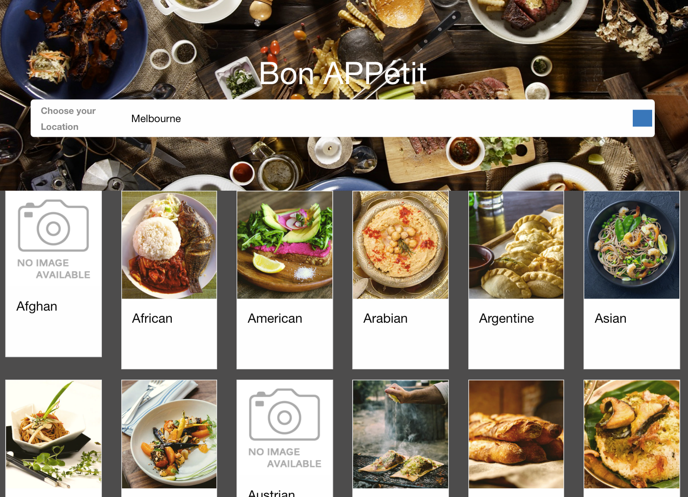
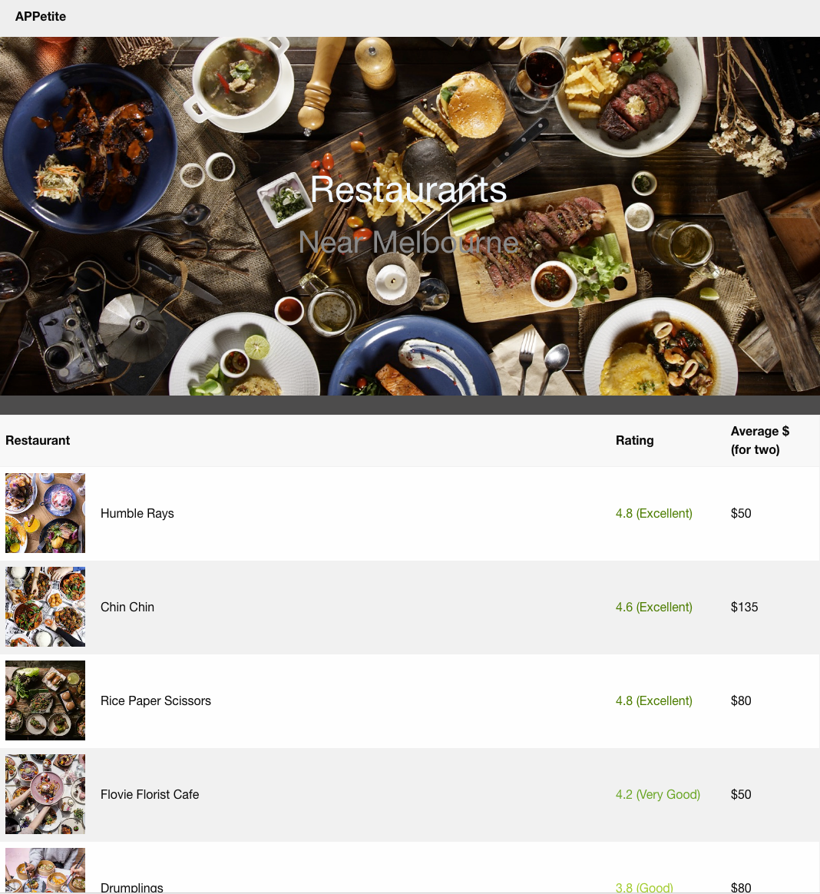

# APPetite

APPetite is a web browser based app that connects tourists to local cuisines in the area helping to generate sales for local businesses. 

# Technologies utilised

HTML, CSS, Javascript, jQuery, localStorage, AJAX, Foundation by Zurb, API's (ZomatoAPI, Forward & Reverse Geocoding)

# Links

https://karryns.github.io/Project_1/

# ScreenShot

